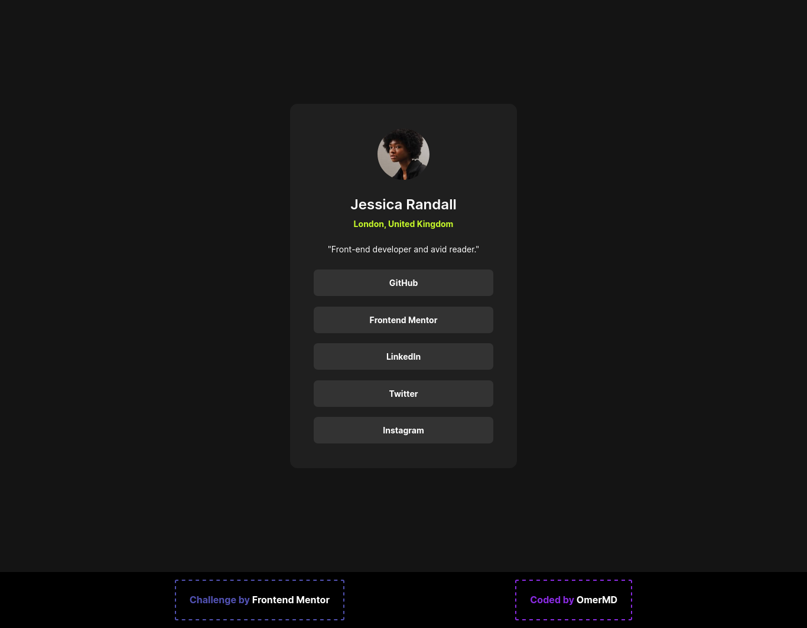
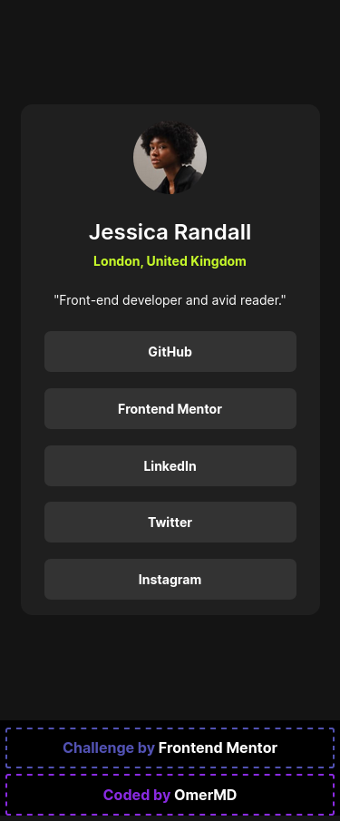

# Frontend Mentor - Social links profile solution

## Table of contents

- [Overview](#overview)
  - [The challenge](#the-challenge)
  - [Screenshot](#screenshot)
  - [Links](#links)
- [My process](#my-process)
  - [Built with](#built-with)
  - [What I learned](#what-i-learned)
  - [Continued development](#continued-development)
- [Author](#author)
- [Acknowledgments](#acknowledgments)

## Overview

Uh...

### The challenge

Make it as close to this as possible! I think it's cool yay!

<a href="https://www.frontendmentor.io/challenges/social-links-profile-UG32l9m6dQ/hub">Social links profile</a>

### Screenshot

Desktop Version

Mobile Version

### Links

- Solution URL: [Solution](https://github.com/MaskeyDude/social-links-profile_frontendo)
- Live Site URL: [Live Site](https://maskeydude.github.io/social-links-profile_frontendo/)

## My process

### Built with

- HTML
- CSS Grid

### What I learned

That I like these cards!

### Continued development

Um... I'll keep making more as practicing is making me better

## Author

- Website - [OmerM](https://www.omerm.42web.io/index.html?i=1)
- Frontend Mentor - [@MaskeyDude](https://www.frontendmentor.io/profile/MaskeyDude)

## Acknowledgments

I'm just glad these exist I don't know what I'll do without them...